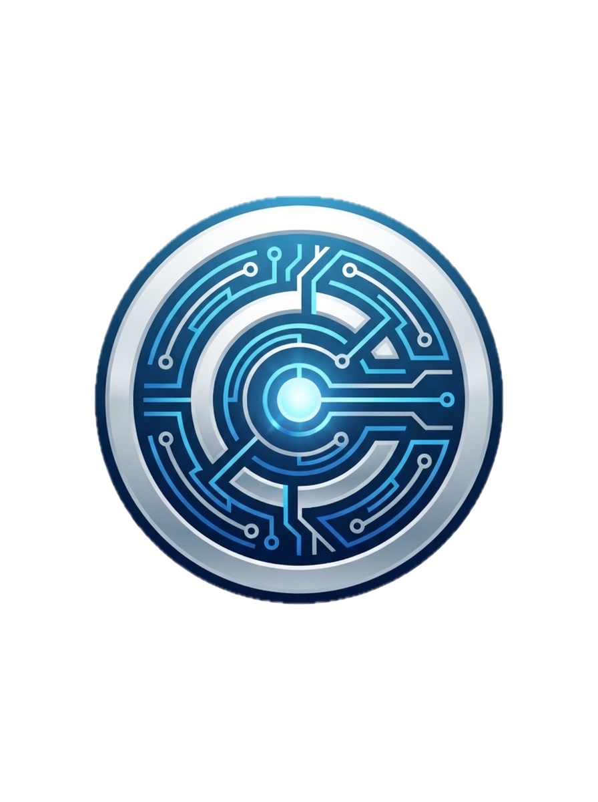

# F5 Distributed Cloud Design Challenge



## Overview

This lab exercise presents a fictional scenario where **Capsule Corporation**—Earth's leading technology conglomerate from the Dragon Ball Z universe—faces critical infrastructure and security challenges that F5 Distributed Cloud (XC) can solve. Participants design and implement an F5 XC architecture addressing hybrid cloud connectivity, API security, DDoS/WAF/bot protection, and performance optimization.

The exercise includes working demo applications, a security configuration validator ("Scouter"), and a themed web portal that presents the challenge brief and validates implementations.

---

## The Scenario

### About Capsule Corporation

Capsule Corporation, founded by Dr. Brief and led by CTO Bulma Brief, is Earth's premier technology company. Known for revolutionary Hoi-Poi Capsule technology that can shrink vehicles, houses, and equipment into pocket-sized capsules, the company serves 890 million customers across 156 countries with Ƶ4.2 trillion in annual revenue.

### Current Infrastructure

Capsule Corp operates a hybrid infrastructure spanning:

| Location | Environment | Workloads |
|----------|-------------|-----------|
| **West City HQ** | On-Premises Data Center | Core manufacturing systems, inventory management (2.3M SKUs), R&D laboratories, employee systems |
| **Frieza Force Cloud** | Galactic Cloud Provider | Customer-facing e-commerce, Dragon Radar API, mobile app backend, Gravity Chamber control plane, vehicle tracking, payment processing |

### Critical Challenges

The company faces escalating threats and operational issues:

- **DDoS & OWASP Attacks**: The Red Ribbon Army cyber-collective launched coordinated Layer 7 attacks during the Capsule Car Model X launch, peaking at 847,000 req/sec and causing 4 hours of downtime with Ƶ215B in losses.

- **Performance Issues**: Dragon Radar API latency varies wildly—80ms in Japan but 950ms in Europe—generating thousands of support tickets from artifact hunters.

- **Fragmented Security**: Cloud and on-premises environments run different WAF tooling with no unified policy enforcement, requiring 23 hours/week reconciling alerts across platforms.

- **Compliance Gaps**: PCI-DSS audit identified 14 critical vulnerabilities and 6 unvalidated endpoints in payment processing APIs.

### Recent Incidents

| Date | Incident | Impact |
|------|----------|--------|
| November | Credential stuffing attack using 2.3M leaked credentials | 847 accounts compromised |
| December | SQL injection campaign against Gravity Chamber API | 3 successful WAF bypasses |
| January | Launch day traffic spike (340% above projections) | 30% request failures for 47 minutes |

---

## Design Objectives

Participants must design an F5 Distributed Cloud solution addressing:

1. **Hybrid Cloud Architecture** — Unify security and connectivity across Frieza Force Cloud and West City on-premises. Enable secure east/west communication between manufacturing systems and cloud services.

2. **API Security** — Protect the Dragon Radar API (high-volume, global) and e-commerce payment APIs (PCI-DSS scope) using F5 XC services.

3. **DDoS, WAF & Bot Protection** — Defend against sophisticated Layer 7 attacks targeting product launches. Address credential stuffing using residential proxies.

4. **Performance Optimization** — Reduce Dragon Radar API latency for European users from 950ms to under 150ms. Handle 340%+ traffic spikes during product announcements.

5. **Unified Management** — Provide Bulma's security team centralized visibility and policy control, eliminating alert reconciliation overhead.

---

## Demo Applications

The lab includes three working applications that simulate Capsule Corp's production workloads:

### Dragon Radar API

A REST API that simulates the Dragon Radar device, returning real-time positions of the seven Dragon Balls. Positions drift over time to simulate movement.

| Endpoint | Description |
|----------|-------------|
| `GET /api/radar/scan` | Get all 7 Dragon Ball positions |
| `GET /api/radar/ball/:id` | Get single ball position (1-7) |
| `GET /api/radar/distance?lat=X&long=Y` | Find nearest ball to coordinates |
| `GET /api/radar/health` | Health check |

**Demo Scenarios**: Rate limiting, OAS validation, global performance, API security testing

### Capsule Corp Store

A full-featured e-commerce storefront selling Hoi-Poi Capsules. Server-rendered with EJS templates featuring product catalog, shopping cart, authentication, and checkout flow.

**Demo Credentials**:
- `demo` / `demo` — Demo User
- `bulma` / `capsule123` — Bulma Brief
- `vegeta` / `prince123` — Vegeta
- `goku` / `kamehameha` — Son Goku

**Demo Scenarios**: WAF protection (SQLi, XSS), bot protection, DDoS mitigation, PCI compliance validation

### Gravity Chamber

A real-time WebSocket application simulating the training chamber control system at West City HQ. Streams chamber state including gravity levels, safety thresholds, and current trainee (Vegeta, Goku, Trunks, or Piccolo).

**Demo Scenarios**: Private multi-cloud networking (MCN), hybrid connectivity validation, RFC1918 network segmentation verification

---

## Scouter: Security Configuration Validator


The **Scouter** is an automated security testing tool inspired by the power-level readers from Dragon Ball Z. It validates F5 XC configurations by running targeted tests against the demo applications and calculating a "power level" score based on results.

### Dragon Radar API Tests

| Test | What It Does |
|------|--------------|
| **Rate Limiting** | Sends 50 rapid requests within 2 seconds, verifies HTTP 429 responses |
| **OAS Validation** | Tests OpenAPI spec enforcement by calling documented and shadow endpoints |
| **Global Performance** | Validates public IP resolution, measures latency across requests |
| **API Security** | Tests SQL injection, directory traversal, and oversized header attacks |

### Capsule Store Tests

| Test | What It Does |
|------|--------------|
| **WAF Protection** | Sends OWASP Top 10 attack patterns (XSS, SQLi, command injection) |
| **Bot Protection** | Tests with automated user-agents and suspicious request patterns |
| **DDoS Mitigation** | Simulates burst traffic, checks for rate limiting and challenges |
| **PCI Compliance** | Validates TLS version, cipher suites, HSTS, and security headers |

### Gravity Chamber Tests

| Test | What It Does |
|------|--------------|
| **Chamber Availability** | Establishes WebSocket connection, verifies chamber state data |
| **Private Network (RFC1918)** | Resolves FQDN and verifies it returns a private IP address |

When all tests pass with strong configurations, the power level exceeds 9000—triggering the iconic "IT'S OVER 9000!" message.

---

## Architecture

```
┌─────────────────────────────────────────────────────────────┐
│                     THE INTERNET                            │
└────────────────────────────┬────────────────────────────────┘
                             │
                             ▼
┌─────────────────────────────────────────────────────────────┐
│                F5 DISTRIBUTED CLOUD                         │
│         Security • Connectivity • Performance               │
└───────────────┬─────────────────────────────┬───────────────┘
                │                             │
                ▼                             ▼
┌───────────────────────────┐   ┌───────────────────────────┐
│      WEST CITY HQ         │   │   FRIEZA FORCE CLOUD SITE │
│   On-Premises Data Center │   │   Galactic Region: Earth  │
├───────────────────────────┤   ├───────────────────────────┤
│ • Capsule Corp Store      │   │ • Dragon Radar API        │
│ • Dragon Radar API        │◄──┤ • Gravity Chamber         │
│ • Gravity Viewer          │   │                           │
│                           │   │      (East/West MCN)      │
└───────────────────────────┘   └───────────────────────────┘
```

### Service Ports

| Port | Service |
|------|---------|
| 8080 | Capsule Info Portal (main entry point) |
| 3000 | Capsule Corp Store |
| 3001 | Dragon Radar API |
| 3003 | Gravity Chamber |

---

## Running the Lab

### Prerequisites

- Docker and Docker Compose
- Web browser

### Quick Start

```bash
# Clone the repository
git clone <repo-url>
cd onsite

# Start all services
docker compose up -d

# Open the portal
open http://localhost:8080
```

### Portal Navigation

- **Challenge** — Company overview, infrastructure details, incidents, and design objectives
- **Demo Apps** — Documentation for each application with endpoints and test scenarios
- **Scouter** — Security configuration validator with interactive testing panels

---

## Technology Stack

- **Runtime**: Node.js 20
- **Framework**: Express.js
- **Templating**: EJS (Capsule Store)
- **Real-time**: WebSocket (Gravity Chamber, Scouter)
- **Gateway**: Nginx (Capsule Info portal)
- **Containerization**: Docker Compose
- **Styling**: Custom CSS with Dragon Ball Z "Saiyan Tech" aesthetic

---

## Lab Activities

### Activity 1: Explore the Challenge

1. Navigate to the Challenge page and review Capsule Corp's infrastructure and challenges
2. Understand the hybrid architecture (West City HQ + Frieza Force Cloud)
3. Review recent security incidents and their business impact

### Activity 2: Examine Demo Applications

1. Visit the Demo Apps page to understand each application's purpose
2. Test the Dragon Radar API endpoints directly
3. Browse the Capsule Corp Store and test the checkout flow
4. Download the OpenAPI spec for Dragon Radar API

### Activity 3: Design F5 XC Solution

Based on the challenge brief, design an F5 XC architecture that addresses:
- Hybrid connectivity between on-prem and cloud
- API protection for Dragon Radar and e-commerce
- Bot and DDoS mitigation for product launches
- Performance optimization for global users
- Unified visibility and management

### Activity 4: Implement and Validate

1. Configure F5 XC services according to your design
2. Point the demo applications through F5 XC
3. Use the Scouter to validate your configuration
4. Achieve a power level over 9000!

---

## Files and Structure

```
onsite/
├── capsule-info/          # Main portal (nginx-served static site)
│   ├── index.html         # Challenge brief
│   ├── apps.html          # Demo app documentation
│   ├── scouter.html       # Security validator UI
│   └── scouter.js         # Scouter frontend logic
├── capsule-store/         # E-commerce application
├── dragon-radar-api/      # REST API with Swagger docs
├── gravity-chamber/       # WebSocket real-time service
├── gravity-viewer/        # Chamber visualization frontend
├── scouter-app/           # Security test backend
├── docker-compose.yml     # Container orchestration
└── LAB_SUMMARY.md         # This document
```

---

## Credits

This lab exercise was created for F5 Sales Engineering onsite training. The Dragon Ball Z theme and Capsule Corporation branding are used for educational and demonstration purposes.

*"The power level... it's over 9000!"*
